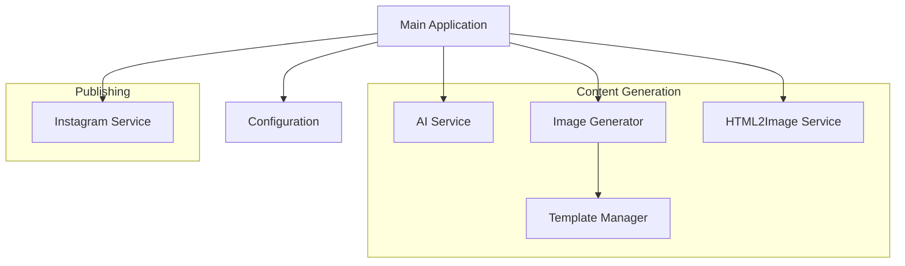

# System Patterns

## System Architecture
FixIn5Mins follows a modular service-based architecture where specialized services handle specific aspects of the content generation and posting workflow:

## Key Components

### Core Services
1. **AI Service (`aiService.ts`)**
   - Handles text generation for prompts, captions, and quotes
   - Communicates with external AI API 

2. **Image Generator (`imageGenerator.ts`)**
   - Orchestrates image creation from templates
   - Uses template manager to select appropriate templates

3. **Template Manager (`templateManager.ts`)**
   - Manages template files and configurations
   - Handles template selection and rendering

4. **HTML2Image Service (`html2image.ts`)**
   - Converts HTML templates to images
   - Manages various template styles and layouts

5. **Instagram Service (`instagram.ts`)**
   - Handles authentication and posting to Instagram
   - Manages Graph API interactions

### Support Components
1. **Configuration (`config.ts`)**
   - Centralizes environment variables and configuration
   - Validates required settings

2. **Template Configuration (`templateConfig.ts`)**
   - Defines template metadata and mappings
   - Specifies template types and properties

3. **Main Application (`index.ts`)**
   - Orchestrates the workflow
   - Processes command-line arguments
   - Manages the content generation pipeline

## Key Technical Decisions

1. **TypeScript**
   - Strong typing for better code quality and maintainability
   - Interface-driven design for clear service boundaries

2. **Service-Based Architecture**
   - Modular services with clear responsibilities
   - Easy to extend with new content types or services

3. **Template-Based Image Generation**
   - EJS templates for flexible content rendering
   - Local templates instead of relying on external AI services
   - Configuration-driven template management

4. **External API Integration**
   - Custom AI service for text generation
   - HTML2Image for template rendering
   - Instagram Graph API for posting

5. **Command-Line Interface**
   - Simple CLI for different generation scenarios
   - Flexible parameter options for customization

## Design Patterns

1. **Factory Pattern**
   - Used for creating different types of content (posts, quotes, carousels)
   - Allows for easy addition of new content types

2. **Service Pattern**
   - Isolates external dependencies into dedicated services
   - Provides clean interfaces for the main application

3. **Configuration Management**
   - Centralized configuration via environment variables and template config
   - Validation of required configuration values

4. **Template Pattern**
   - EJS templates with variable substitution
   - Reusable template components

5. **Async/Promise Patterns**
   - Proper handling of asynchronous API calls
   - Error handling and retries for external services

## Component Relationships

- **Main Application → Services**: Orchestrates the content generation and posting workflow
- **Image Generator → Template Manager**: Selects and uses templates for image generation
- **Template Manager → Template Files**: Loads and renders template files
- **HTML2Image → Rendered Templates**: Converts rendered templates to images
- **AI Service → External API**: Generates text content via external AI service
- **Instagram Service → Graph API**: Posts content to Instagram

## Error Handling Strategy
- Service-level error handling with appropriate retries
- Graceful degradation when services are unavailable
- Detailed error reporting for debugging

## Extensibility Points
- New content types can be added by extending the content generation pipeline
- Additional templates can be added by creating new template folders and configurations
- Additional social media platforms can be supported with new service implementations 