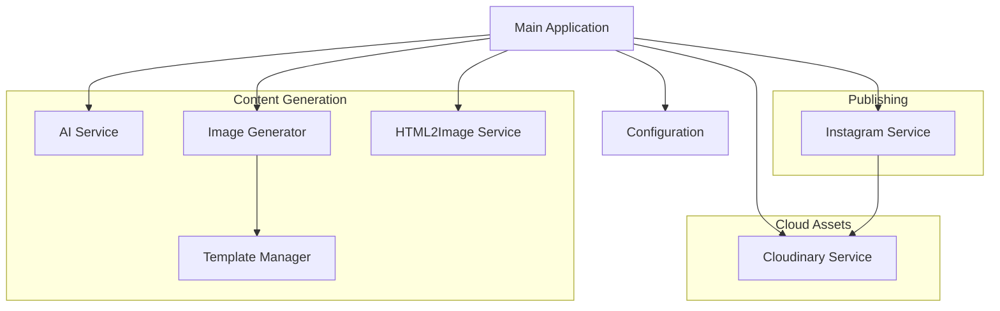

# System Patterns

## System Architecture
FixIn5Mins follows a modular service-based architecture where specialized services handle specific aspects of the content generation and posting workflow:

## Key Components

### Core Services
1. **AI Service (`aiService.ts`)**
   - Handles text generation for prompts, captions, and quotes
   - Communicates with external AI API 

2. **Image Generator (`imageGenerator.ts`)**
   - Orchestrates image creation from templates
   - Uses template manager to select appropriate templates

3. **Template Manager (`templateManager.ts`)**
   - Manages template files and configurations
   - Handles template selection and rendering
   - Supports multiple template designs (quote-red, self-love-gradient, etc.)

4. **HTML2Image Service (`html2image.ts`)**
   - Converts HTML templates to images
   - Manages various template styles and layouts

5. **Instagram Service (`instagram-carousel.ts`)**
   - Handles authentication and posting to Instagram
   - Manages Graph API interactions
   - Provides separate functions for single images and carousels

6. **Cloudinary Service (`cloudinary.ts`)**
   - Manages image hosting in the cloud
   - Handles uploading, retrieving, and deleting images
   - Provides public URLs for Instagram posting

### Support Components
1. **Configuration (`config.ts`)**
   - Centralizes environment variables and configuration
   - Validates required settings
   - Manages configurations for all external services (Instagram, Cloudinary, etc.)

2. **Template Configuration (`templateConfig.ts`)**
   - Defines template metadata and mappings
   - Specifies template types and properties
   - Registers all available templates
   - Provides default variables for each template

3. **Main Application (`index.ts`)**
   - Orchestrates the workflow
   - Processes command-line arguments
   - Manages the content generation pipeline

### Templates
1. **quote-red**
   - Red typography on cream textured background
   - Support for quotes and emotional content structure

2. **self-love-gradient**
   - Gradient background from blue/lavender to pink/orange
   - Modern typography with serif and script fonts
   - Centered pill design for handle name
   - Support for emotional content structure

3. **fixin5mins-post**
   - Brand-specific template for core content
   - Support for emotional hooks, action steps, and rewards

4. **Other Templates**
   - quote-basic: Simple quote format
   - post-gradient: General post template
   - carousel-3panel: Three-panel carousel format

## Key Technical Decisions

1. **TypeScript**
   - Strong typing for better code quality and maintainability
   - Interface-driven design for clear service boundaries

2. **Service-Based Architecture**
   - Modular services with clear responsibilities
   - Easy to extend with new content types or services

3. **Template-Based Image Generation**
   - EJS templates for flexible content rendering
   - Local templates instead of relying on external AI services
   - Configuration-driven template management
   - Registration of templates in templateConfig.ts
   - Support for different template designs with consistent variables

4. **Responsive Design in Templates**
   - Dynamic font sizing based on content length
   - Adaptive layouts for different content types
   - Consistent branding across template variations

5. **Cloud-Based Image Hosting**
   - Cloudinary integration for reliable image hosting
   - Public URLs for Instagram API compatibility
   - Automatic cleanup after successful posting

6. **External API Integration**
   - Custom AI service for text generation
   - HTML2Image for template rendering
   - Instagram Graph API for posting
   - Cloudinary API for image hosting

7. **Command-Line Interface**
   - Simple CLI for different generation scenarios
   - Flexible parameter options for customization
   - Template selection via command-line arguments

## Design Patterns

1. **Factory Pattern**
   - Used for creating different types of content (posts, quotes, carousels)
   - Allows for easy addition of new content types

2. **Service Pattern**
   - Isolates external dependencies into dedicated services
   - Provides clean interfaces for the main application

3. **Configuration Management**
   - Centralized configuration via environment variables and template config
   - Validation of required configuration values
   - Registration of templates in a central configuration file

4. **Template Pattern**
   - EJS templates with variable substitution
   - Reusable template components
   - Consistent structure across different template designs
   - Dynamic styling based on content length

5. **Adapter Pattern**
   - Used to integrate external services with standardized interfaces
   - Simplifies switching between different providers (e.g., local vs. cloud storage)

6. **Strategy Pattern**
   - Different strategies for posting to Instagram (single image vs. carousel)
   - Allows for runtime selection of appropriate posting method
   - Template selection strategy based on content type

7. **Async/Promise Patterns**
   - Proper handling of asynchronous API calls
   - Error handling and retries for external services

8. **Registry Pattern**
   - Central registration of templates in templateConfig.ts
   - Templates accessed by ID throughout the application
   - Default variables for each template

## Component Relationships

- **Main Application → Services**: Orchestrates the content generation and posting workflow
- **Image Generator → Template Manager**: Selects and uses templates for image generation
- **Template Manager → Template Files**: Loads and renders template files
- **Template Manager → Template Config**: Retrieves template metadata and defaults
- **HTML2Image → Rendered Templates**: Converts rendered templates to images
- **Cloudinary Service → Generated Images**: Uploads and manages images in the cloud
- **Instagram Service → Cloudinary Service**: Uses image URLs from Cloudinary for posting
- **AI Service → External API**: Generates text content via external AI service
- **Instagram Service → Graph API**: Posts content to Instagram

## Template Design Principles
- **Consistency**: All templates follow a consistent structure with similar variable naming
- **Responsiveness**: Templates adapt to different content lengths using dynamic sizing
- **Branding**: Templates maintain brand identity with consistent messaging
- **Visual Hierarchy**: Clear distinction between different content elements
- **Extensibility**: Easy to create new template variations
- **Registration**: All templates must be registered in templateConfig.ts

## Error Handling Strategy
- Service-level error handling with appropriate retries
- Graceful degradation when services are unavailable
- Detailed error reporting for debugging
- Automatic fallback to local assets when cloud services fail
- Cleanup of resources in error scenarios
- Template validation during application startup

## Extensibility Points
- New content types can be added by extending the content generation pipeline
- Additional templates can be added by creating new template folders and configurations
- Alternative template designs can be implemented with consistent variables
- Additional social media platforms can be supported with new service implementations
- Alternative image hosting providers can be integrated with minimal changes
- Scheduling capabilities can be added as a new service layer 